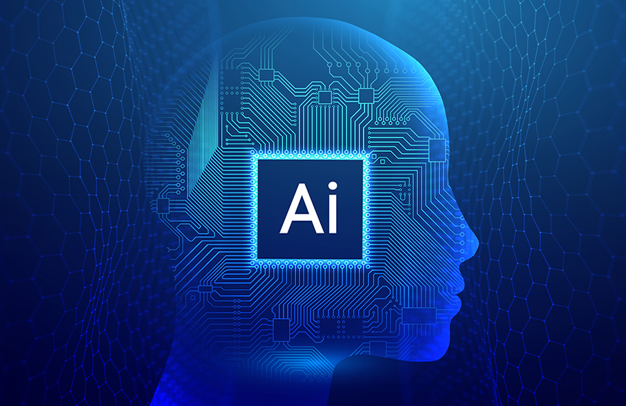

<figure>
  
  <figcaption>Source: “How will artificial intelligence (AI) Power New Learning in Education?,” College of Education, https://education.illinois.edu/about/news-events/news/article/2023/02/08/the-power-of-ai-in-education (accessed Nov. 18, 2023). .</figcaption>
</figure>

# Introduction
Artificial Intelligence (AI) has emerged as a revolutionary way to embed software and machines with mock human intelligence. There is no question that it has produced one of the biggest ripples in the advancement of human technology of this decade. Specifically, in the education industry, AI has played a pivotal role in introducing a new paradigm for both teaching and learning environments. While this applies to most any specialization, the true impact of AI on education is most apparent in Software Engineering in my opinion. The main benefit of this new paradigm is the overwhelming adaptability of it all. Traditional education normally has core literatures, documentations, courses, etc. While more experienced students may find documentation on a framework easy to digest, others may need more visual representation. This type of discrepancy between learning styles can prove difficult to overcome, or design for, when introducing a teaching methodology. This is where AI shines in education. Prompts given to AI can be adapted to the user's personal learning style. Basic concepts that can be muddled behind a wall of jargon, can easily be digested using simplification through such AI. Other times, one may require a real-world example to better understand an application of a concept that AI can generate on the spot. Given that the user is sufficient and detailed in their questions, and also that they have already put in a fair amount of effort, AI can most definitely be a powerful tool to enhance learning in software environments. 

# ChatGPT
The reason why I advocate so heavily for the use of AI in learning is because of my experiences with it in many software based courses, including ICS 314. While other AI tools can be helpful in certain scenarios, I find most of them confuse me and push me off track more than help me. Throughout this semester I have used ChatGPT to enhance and accelerate my learning experience almost exclusively, thus the remainder of my essay will be focused on specifically that.  

# Personal Experience 
For the ICS 314 course I have been taking this semester, there has been plenty of opportunities to integrate ChatGPT into my learning experience. For some, I took advantage of the benefits of ChatGPT, but for others, I decided not to since it seemed more harmful than good. Below is a list of course related topics and my thought process behind the use of AI with each.

### WODs
In this course, we often were assigned daily exercises called WODs. We often had exercise, in-class practice, and in-class assessment based WODs. A WOD was meant to test a student’s proficiency in a certain aspect of the course, whether it be a particular concept or some framework being used. For these exercises, I rarely used ChatGPT. To me, it seemed counterintuitive since the purpose of these WODs was to ensure a complete understanding of the material for that week. By using AI, it would be impossible to tell if one could have solved the problem on their own. While I do believe that AI is a good time saver for menial questions, once you get to more complex prompts, AI tends to fail in completely comprehending the problem. Thus, you must have some kind of understanding on the needed steps to solve harder problems. ChatGPT won’t give you the answer straight up. Therefore, for these WODs I opted to not use ChatGPT so that I could properly evaluate my problem solving skills. However, for the remaining work assigned for this class, I often did use ChatGPT and I will explain why.

### Essays
For essays, ChatGPT can be very helpful. I often have it write outlines for me by giving it a prompt on the needed components of my essay. Similar to the outline for this essay, it will spit out the structuring that I need to have. In addition, I can ask for an “introduction on the advantages of meteor” or be more specific and ask to “explain each of the components of OpenStack”. Either way, a relatively in-depth outline will be spit out. This is beneficial for one main reason. Structure.
Without doing any reading yet, it can kick start you with ideas for what to focus on in your essay, and how to structure it. Often I will look through the generated outlines, pick out topics that I believe are worthy of being included, and then begin a literature search for sources. This saves me massive amounts of time that I would have used sifting through reference lists. But, more importantly, it lets me structure my essay before starting it.  In traditional journal papers I have been a part of, we normally work from a specific recent paper, and work our way backwards through a reference list to look for concepts we want to include. We start with some idea of what our paper will be about, and work through body paragraphs, including data and making revisions as we go. It is very common to save the introduction paragraph for last, after we fully understand the structure of the paper. However, with ChatGPT, I can reverse this process by starting with the concepts I want to include, then looking for the sources afterwards. I can write my introduction early based on those concepts and then adhere to the format for the remainder of the writing process. This has been significantly helpful in my writing experience as I often get lost in the many directions my essays can go.
It is to be noted that this type of AI-assisted writing style can have its downsides as well. Some could argue that this could lead to plagiarism, but I am often very careful of this. I take concepts, but find my own sources and form my own paragraph structures. Another possible disadvantage is that it can weaken creative thinking for these types of essays. This can be true, but I think it depends on the type of essays being written. I wouldn’t use ChatGPT on very specialized essays, based on work I have done, but I would use it 9 times out of 10 if it's some type of informative essay to save time. Overall, essays are a good candidate for the use of AI in my opinion.

### Learning-Based Course Elements
Moving on to what I believe is the most beneficial use of ChatGPT, I commonly used the tool for learning new concepts. For coding specifically, most resources are in the form of official documentation. While this documentation is useful for understanding how to use various functions/frameworks, you often need to know the specific names to actually look them up. If you have an idea of what you want to do, but don’t know the syntax or libraries enough, ChatGPT is extremely helpful in giving it to you. For example, I would write a prompt to ask “what underscore function can be used to square every number in an array of integers”, and ChatGPT will tell me to use the map function. One potential downside of this is that the answer is locked to this prompt. Another method of doing this type of squaring could be to use the reduce function from the same library, but unless I specify that I want to use the reduce function, it will almost always give me the map function as the answer. Even so, this tool is helpful in these scenarios. 
I also use AI when I want to ask questions. The trick is to have very specific questions, and to feed it all the information you already know. The more information you give a prompt, the better the answers will be. This is why I said in the introduction, that you have to have some knowledge of the question your asking and put in some effort to actually solve it yourself, else you get rubbish and you won’t be able to recognize its rubbish. The same idea of asking a smart question to a StackOverflow user is needed for asking ChatGPT. This methodology is needed if you want code to be generated from prompts.
Most times, if the question is simple, the code will work, but it may not be the way you intended, or the most efficient way. Therefore, when I use ChatGPT for code generation, it's often a two-step process. Once I give a smart prompt to the AI, I also have to test the code and understand it. The functions of libraries ChatGPT will use will often be standard packages, unless you specify ones to use (which is why it's better to have an understanding beforehand). To understand the code that it writes, if you haven’t used those packages before, it's very simple to ask lots of questions on it. I typically ask for basic explanations of certain functions right in the engine, minimizing the need to look through documentation. Also, I like to give examples of scenarios I need to use the code for. Sometimes, the AI will catch errors in the code when you give it a specific application. E.g. The code is built for arrays but you are using objects. Throughout this process, you will also find it beneficial to use these explanations to document your process. I often discretize code into functions and give overall summaries on what the function takes as arguments, and what it outputs for starters.
The TLDR is that you can use ChatGPT to generate code, to fix code, to explain code, and to document code for complex problems as long as you provide a sufficient amount of information and specifications in what it is your truly looking for. 

### Final Project
Finally, the last ICS 314 course element that I have used ChatGPT on is the final project. I don’t use it much for large concepts since it does not have real-time access to the entire project directory, meaning it lacks knowledge on the interdependence of the project scripts. In addition, if I used ChatGPT to generate code for a multi-folder project like this, I wouldn’t be able to practice my meteor skills in a practical environment, which is what I think the true benefit of a project like this provides. Therefore, I tend to stay away from ChatGPT for integration needs. However, I did use it to generate basic functions that are useful in single files, since this time-saving methodology is what ChatGPT shines in. For example, in a contact page in our project, it required the user to input an email before sending a feedback message. To handle validation of the user-inputted email, I knew a common method was through the use of a RegEx. However, they are often complicated to write, and I had never really learned how to do so before. Therefore, I used ChatGPT to generate RegEx’s for me to put into a function. I implemented this function into a Simple Schema for the contact form and tested it to various types of possible email inputs. I could see what passed as valid and what didn’t. In addition, when I noticed a potential edge case, I could tell ChatGPT about it and have it modify the RegEx. In the end, it wasn’t able to completely track all edge cases, but for the scope of this project, it did its job and was very helpful. 

# Impact on Learning and Understanding
As described in Section 2, I used ChatGPT for many things this semester. To reiterate, I think its most helpful to search for reliable packages and functions when you don’t already know which ones to use. Its also very useful at giving example template code for those packages, similar to how the meteor react template provided to the class for our final project is used. AI should be used as a resource in tandem with ones own critical thinking to minimize the need of searching the internet for solutions. The developer comes up with the solution, and the AI gives them the packages that they can use to implement it. This is the most effective impact AI has on learning in my opinion. 

# Practical Applications
Besides learning, AI is also a necessity for various industry level applications. As I mentioned before, ChatGPT is limited in the quality of code it can provide based on the engineered prompt it is given. However, AI in general is way more powerful at problem solving when it’s designed for specific functionality. In other words, if the AI is trained to handle a specific set of problems, rather than being trained on the entire internet (bad data included), it can have higher accuracy for the use-case. For example, almost every popularized instance of image recognition technology is based on some form of AI nowadays. Tesla’s self-driving cars are probably the most well-known example. With the AI that is specifically built for autonomous driving, it becomes very good at it. It doesn’t have any additional noisy data, and its sole purpose is to get better at monitoring the road and performing without the need of human interaction. This is the true power of AI in an industry-to-industry environment. 

# Challenges
While AI is helpful, it certainly is not bulletproof. As I mentioned before, ChatGPT is extremely bad at working with large amounts of interconnected files. In addition, it can’t make complex calculations, or even rudimentary ones sometimes. If you want to try to run a formula with ChatGPT, good luck. Another problem with AI, is that it depends heavily on the influx of updated data. ChatGPT 3.5 is trained on data prior to late 2021. In one specific case in my final project, I mentioned I used it to write a RegEx string since I didn’t have much knowledge on them. Originally, it wanted me to use a SimpleSchema.RegEx attribute that didn’t work upon trial. After some documentation searching, I realized it didn’t work because it was prone to DDOS attacks, and had since been removed altogether. Therefore, it is always good to look through official up-to-date documentation after using AI for learning. Despite these downsides, I still think the adaptability of AI is still more beneficial than not in learning environments.

# Comparative Analysis 
Traditional teaching is definitely better in keeping knowledge memorized for longer amounts of time. The constant repetition of doing a homework problem retains that knowledge and cannot fully be replaced by AI. However, to actually apply that knowledge to problems, especially in software engineering, I think AI has an advantage. As I mentioned in previous sections, it is very adaptable to learning styles and I often find it helpful to visualize concepts in example scenarios generated through AI.

# Future Considerations 
Traditional teaching can never be fully replaced by AI. It's a given that some students will always abuse its powers and use it as a quick solution to any problem without any critical thinking. In this case, AI is extremely detrimental to the development of one's skills. However, I think if schools taught students how to effectively create prompts and to effectively use AI as a collaborative tool, rather than an answer-giving tool, then it would be much more effective than it has been. I believe this is an opportunity that can be explored.

# Conclusions
AI is undeniably a valuable asset, but it should not be regarded as the ultimate solution for all problems. It's far from being perfected, and can still lead students to go on unneeded tangents.  Nevertheless, AI serves as an excellent stepping stone towards proficient learning, and it can’t be discounted. AI will undoubtedly continue to be improved and because of this, the educational system should continue to integrate it as a valid resource. If it will be around in the future, it should be utilized to the best of its ability. 
