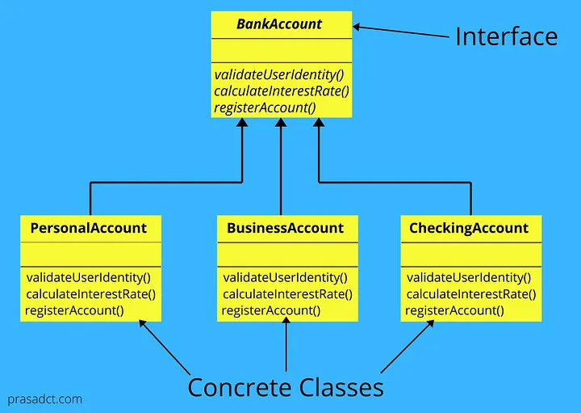

<figure>
  
  

    <figcaption>Source: [1].</figcaption>
  

</figure>

# The Recipe to Success

One of my favorite breakfast foods is fried rice and I often find myself making it on most weekends mornings. My favorite fried rice to eat has Portuguese sausage, but sometimes I make it with bacon, spam, or whatever other meat I have lying around. Either way, the bulk of the recipe remains the same. Cook the meat. Cook the eggs. Stir in some rice. Add seasoning. No matter what type of fried rice I make, the process and some of the ingredients are constant.This same concept of a “recipe” can be used when creating software, and it’s often referred to as a <strong>design pattern</strong>”. 

Just like cooking has recipes, software engineering has design patterns. Similar problems tend to have similar solutions. A design pattern acts as a reusable solution to such problems. The template to solve these problems remains constant between them, but small parts may be modified or adjusted to fit some characteristics of the individual prompt, whether it be constraints, wants of the developer, etc. So now that we know what a design pattern is, let's look at a few common examples.

  
# Setting Up a Bank Account

Firstly, imagine that you want to set up a bank account with your local bank. They’ll ask you what type of account you want to open. Maybe you want to open a checking account, or maybe a savings account. Similar to the fried rice analogy, either way, the account needs to have some basic components. You need to be able to validate your identity to access the funds in them, you need to have some type of interest rate, and all of them must be correctly registered by the bank. In this way, we have different <strong>CONCRETE CLASSES</strong> that are based on the same template class. This is known as a <strong>FACTORY</strong> design pattern, since we have a single template that is being modified to suit the needs of various related classes.

# Singular Authority

Another common design pattern is <strong>SINGLETON</strong> patterns. The singleton pattern is very useful to use when exactly one object is needed to coordinate actions across an entire system. The best way to think of this is by thinking of a boss at work. Each employee can act independently, but when an executive decision needs to be made, all have to go to the same boss for the final say. Similarly, using a singleton template, each class has only one instance of itself and there is only one point at which the class can be accessed. This way, the state of that class is accessible to everybody in the same way that each employee knows exactly what the boss wants done next.
  

# Weather Monitoring

Another common scenario that a developer may find themselves in when programming is when we want to develop real time systems. In real time systems, the states of each individual object in a system may have a direct impact on the actions of other objects in that same system. In this way, we would want each object to be notified of changes in other object states so that the appropriate actions can be taken. A well known example of this is used in weather monitoring. When individual sensors throughout the area pick up changes in weather data, the weather apps are informed and real-time updates are executed. This type of adaptiveness is a very powerful tool in most modern web applications and is known as an <strong>OBSERVER</strong> pattern.

# The Online Shopping Experience

The final design pattern I will talk about in this writing is the <strong>MVC</strong> pattern, also known as the Model View Controller pattern. This pattern is common in user interface applications and involves the use of an interface model, a method of viewing the contents of the model, and a interface to control the model. It is used commonly in every application, for example online shopping carts. The cart itself is the model, the windows to view the items in it is a viewing mechanism, and adding and removing items is possible via some type of controller.

# My Own Personal Experience

Now that we’ve talked about what design patterns are and some of the common templates, have I ever used them? The answer is a definite yes. The first thing I do when laying out a new project is always to structure the components and find matching characteristics. In my coding style, I often like to use as many helper functions as I can. This is because I hate typing code repetitively. This goes for classes too. When I wrote my sorting algorithm visualizer code the first thing I did was look for design patterns to use. I recognized that the way I wanted to make the visualizer was to take screenshots of my array and re-render the window on a set cycle. I knew the array visualization would be the same no matter what sorting algorithm I used, so I used a factory design pattern to create various algorithm functions and feed a specific one into an overarching helper function. Each algorithm function had its own method of sorting, but it always returned the same type of output as the last. This shared aspect of each algorithm allowed me to make a single render function that was useable for each algorithm, meaning I didn’t have to worry about any repetitive coding.

# Conclusion

Essentially, if you run into a problem, odds are you’ll run into it again, except it’ll be in a new form. Therefore, a developer should always remember the problems they run into and think of design patterns that can easily be used to solve it. That way, when you inevitably run into it again in your next application, the development process will be that much quicker.

 
[1] Thilakarathne, P. (2020, July 30). Factory method design patternfactory method design pattern with real-world example. Medium. https://prasadct.medium.com/factory-method-design-patternfactory-method-design-pattern-with-real-world-example-4ee909a24ab6 

