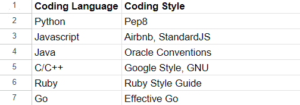

Nowadays, most Integrated Development Environments (IDE) are installed with some type of source code editor, building tools, debugger, and additional quality-of-life plugins. However, in the 80s terminal-based code editors did not permit those luxuries. Anybody that has ever used early text based editors, like VIM, in Linux shell environments, knows that messy code means an unhappy user. Mainly because it is difficult to source bugs in code, especially long code, when indentations are inconsistent or function and variable names are not properly cased. I would say that over 80% of the time I spend writing code in these text-based editors is spent on debugging. Coding standards are so desirable because of this very reason. Increased code readability, reduced chances of bugs, and compatibility are a few benefits of using coding standards that will be explored in this discussion.

## Coding Standards are Actually Helpful

Coding standards exist for all kinds of languages. High-level, low-level, and even hardware languages have their own widely adopted conventions. Figure 1 shows some popular standards for various popular coding languages. These stylizations are widespread in each language’s communities because of all the reasons mentioned at the end of the introduction. When everyone is using the same code style, it becomes readable since everyone knows where to look for a function name or its parameters. In my opinion, the most important readability feature of coding styles is how white space is handled. New lines and indentation are confusing in editors that do not highlight ending brackets. In some languages, like python, brackets aren’t even used to enclose blocks of code. Thus, if small indentations are used, readers may find it difficult to find where certain blocks start and end depending on how quickly they skim through it.

On the same note, improved readability also tends to lead to easier code review, meaning more bugs are caught, and less make it to released versions of code. From a developers perspective, rather than a reviewer, I find it a lot easier to write using a standard as well. It becomes muscle memory to write consistent and clean code when I write the same way over and over. In the end, the consistency has really helped to reduce the amount of typos and bugs I put in my code, since I never think about syntax.  

## Linters

<small>Figure 1: A diagram of a black box abstraction model which simplifies complicated frameworks. Source: [CodeAcademy](https://www.codecademy.com/article/black-box-programming).</small>

 Recently, I’ve been learning Javascript in the IntelliJ Idea IDE. Switching from my mother tongue C to Javascript has been difficult to say the least. It was challenging to learn the syntax and functionality of a new language of course, but adding on the difficulties of coding style made it harder. Linters are tools that are used to combat this learning issue, and recently I’ve been using the ESLint addon in IntelliJ to easily spot errors in my code. ESLint errors don’t block compilation, but they let the user know that the way they are styling their code is not up to standard. Using this tool has helped me not only think about what to code, when learning Javascript, but how to do it.
 

## Stick With It
It may seem frustrating to have to spam through style errors over and over before submitting code because of ESLint, but I promise it’ll be rewarding in the end. Through repetition, coding in the ESLint standard will surely become easier, and you will be able to reap the full benefits of a coding standard.  

Overall, the use of coding standards has completely transformed my coding experience.

