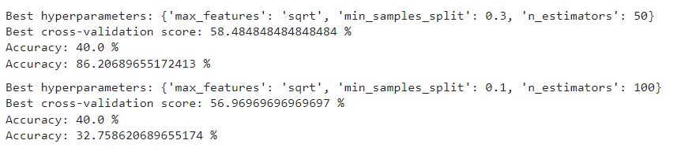

Parkinsons disease is a progressive brain disorder that affects the bodies abilitiy to communicate using its nerves. Since it is progressive, the symptoms worsen over time, and with no real cure for the disease, the best course of action against it involves early detection. With early detection of Parkinsons disease, precautions can be made and treatements can be implemented to slow the progression of this debilitating disease. The MDS-UPDRS scores of patients is a comprehensive score that accounts for motor and non-motor sympotms in patients with Parkinsons disease. By having access to protein and peptide data of individual patients that have Parkinsons disease, we can use patients that are long-time sufferers to gather information. This information is used to train a machine learning model to predict how newer patients protein counts compare. This way, we can predict if patients without Parkinsons are developing it, or at risk of developing it.

This particular approach uses a random forest classifier. A random forest is a machine learning model that combines a large number of decision making trees. These trees decision trees (DT) are a form of supervised learning algorithms that are used for classification and regression models. The nodes of each tree represents a feature of data and they can branch to other nodes depending on the specific values of each training example. Once the leaf nodes are reached, a outcome or class label is set for the training example. For example, in this case, a peptide type can be a feature. Then it takes a branch depending on the count of peptides in the patient. If the peptide count lies in some quantized range, we can choose a certain class label. This quantization is how I turned a regression problem (due to the abstract amount of protein and peptide counts of each patient), into a discretized classifcation problem.

For the current random forest implementation, I cleaned up the training data so that I only had the protein counts of patients that visited in month 0. The number of training samples starts in the thousands, but after trimming the samples to be only patients that visit on both month 0 and month, I was left with less than 60 samples. This means that my prediction accuracy took a drastic hit. However, this is due to a lack of training data. As more data is collected, the accuracy of the models will continue to improve.  
After hyperparameter tuning using GridSearchCV, the following cross-validation accuracy scores were achieved for the prediction of UPDRS-2 and UPDRS-3 scores for patients in month 6.

 
The jupyter notebook containing the random forest classifier approach, utilizing the sklearn library is labeled "random_forest_code-v3.ipynb".

Source: <a href="https://github.com/matthewtkouchi/EE445_Kaggle_Peptides"><i class="large github icon "></i>matthewtkouchi/parkinsons-predictions</a>.
