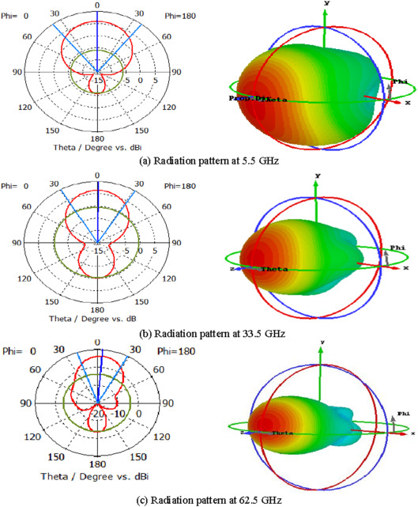
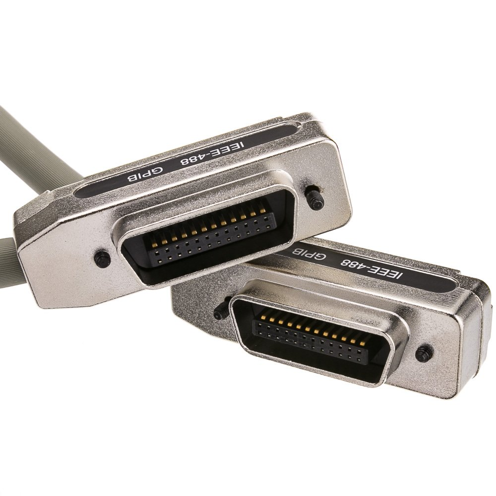

A radiation pattern test is a common test in wireless propagation tests, for example, using antennas, reflect arrays, etc. 
The radiation pattern of a Device Under Test (DUT) is the gain or received power across some angular range around the DUT.
For example, every antenna has a 360 degree radiation pattern measurement done to quantify how directive it is, and the efficiency of it.
An example radiation pattern is shown here (source:https://www.sciencedirect.com/topics/engineering/radiation-pattern):

To automate this type of test on the current testbed of the liquid-metal electronics group, I created a few scripts that use PyVisa to communicate with various 
programmable interfaces of the hardware equipment. For example, the motion controller we used to move the antenna 180 degrees in the azimuth direction is controlled
using a GPIB interface, which is made possible using Serial. However, the code can be modified to work for various interface protocols such as ethernet, usb, etc.

Heres an image of a GPIB connection:  

The script works by first connecting your laptop to the proper interfaces. I needed to use a GPIB to usb to connect my laptop to the motion controller and a USB to ethernet to connect to the network and spectrum analyzers. The code takes care of setting the anglular range of the radiation pattern tests, the speed of the motion controller arm movement, and the measurement of data by sending the correct commands to each instrument at given time intervals. For the most part, the instructions happen almost instantaneously, so setting the frequency markers and reading the measurements off the devices is easy. The only difficulty is setting the correct time delays for each instruction. When the motion controller moves a receiver from 86 degrees to 84 degrees for example, there is some time associated with this movement. This can be adjusted by changing the speed of the motor attached to the MM3000 base. However, to prevent wear and tear, we use a relatively low speed, and instead set a delay on this specific instruciton. Thus, the script waits for the motion controller to finish moving to the new azimuth angle before sending the instruction to the network analyzer to take the reading. This type of consideration is important to not overlook when you are trying to combine functionality of multiple instruments.

I worked with another undergraduate student, David Kimura, on these scripts. We made the scripts since we were both in the same liquid-metal electronics group and the manual testing of various DUT's took up a lot of our free time. Using the script we were able to turn 1 hour tests into 15 minute tests which greatly helped our productivity over the Fall 2022 semester. The current implementation of the automation scripts are made especially for the equipment in the POST 427 labratory. In the future I plan to add a front-end interface using tkinter to improve the quality-of-life of the application.

Source: <a href="https://github.com/matthewtkouchi/automated_test_bed"><i class="large github icon "></i>matthewtkouchi/testbed-automation</a>.
